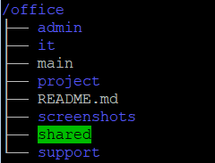
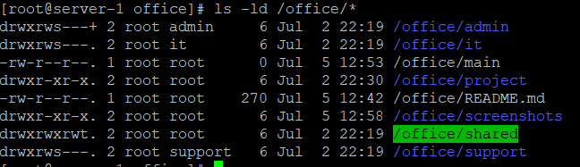
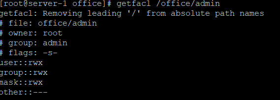

## 🚀 Features

- User Management
- Group Management
- File and Directory Permissions
- Ownership Management
- Access Control Lists (ACL)
- Sticky Bit
- SGID (Set Group ID)


- ## 🛠 Linux Commands Used

```bash
mkdir
useradd
passwd
groupadd
usermod
chmod
chown
chgrp
setfacl
getfacl
ls
tree
id
```


## 📚 Learning Outcomes

- Linux User Management
- Linux Group Management
- Linux File and Directory Permissions
- Ownership Management
- Access Control Lists (ACL)
- Sticky Bit
- SGID
- Git & GitHub Basics


## 📷 Project Screenshots

### Office Structure



### Users and Groups


### File Permissions



### ACL Configuration



### Final Output


